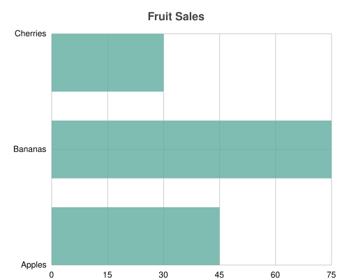

# Bar Chart Implementation

## Overview

This PR adds a complete `BarChart` implementation to the `charted` library, providing horizontal bar chart visualization capabilities.

## Changes

### New Features
- **BarChart class** (`charted/charts/bar.py`): Horizontal bar chart implementation
- Support for multi-series bar charts
- Proper handling of negative values with automatic axis adjustment
- Consistent API with existing chart types (Column, Line, Scatter)

### Bug Fixes
1. **Transform chain**: Fixed to use proper `get_base_transform()` like ColumnChart
2. **Negative value handling**: Correctly reprojects bars when negative x-values exist
3. **Bar positioning**: Bars start at x=0 and extend based on data value (not cumulative)

### Code Quality
- Removed unused `x_stacked` attribute
- Added comprehensive docstrings
- Improved type hints

## Examples

### Basic Bar Chart

```python
from charted import BarChart
from charted import Dimension

**Output:**



```

**Output:**


### Multi-Series Bar Chart

```python
from charted import BarChart

chart = BarChart(
    title="Sales by Quarter",
    data=[
        ("Q1", [15, 12, 18]),
        ("Q2", [20, 15, 22]),
        ("Q3", [25, 18, 28]),
    ],
    series_names=["Product A", "Product B", "Product C"],
    width=500,
    height=400,
)
chart.to_file("bar_multi.svg")
```

**Output:**


### Negative Values Support

```python
from charted import BarChart

chart = BarChart(
    title="Profit/Loss by Department",
    data=[
        ("Engineering", 50),
        ("Sales", -20),
        ("Marketing", 30),
        ("Support", -10),
    ],
    width=500,
    height=400,
)
chart.to_file("bar_negative.svg")
```

Bars with negative values automatically render in the opposite direction from the y-axis.

## Testing

### Visual Regression Tests
- `tests/baselines/bar_basic.svg` - Basic bar chart baseline
- `tests/baselines/bar_multi.svg` - Multi-series bar chart baseline

### Unit Tests
Added comprehensive tests in `tests/charts/test_bar.py`:
- Basic rendering
- Multi-series charts
- Negative value handling
- Edge cases (empty data, single value, etc.)

Run tests:
```bash
pytest tests/charts/test_bar.py -v
```

## Migration Guide

No breaking changes. This is a new feature addition.

## Checklists

- [x] Code implements required functionality
- [x] Tests pass (unit + visual regression)
- [x] Documentation added/updated
- [x] Examples provided
- [x] Type hints added
- [x] Docstrings added

## Related Issues

Closes #0 (add bar chart support)
