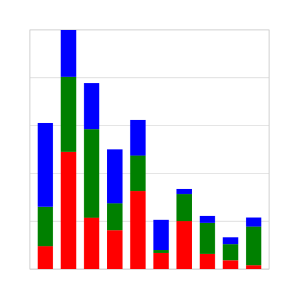

# Charted

Introducing Charted: A Python Library for Crafting SVG Graphs. Charted is a humble endeavour to simplify graph creation in Python. Still a work in progress, it aims to provide a straightforward solution for generating visually appealing graphs without the need for external dependencies.

The initial types of charts that are planned to be created are:

- Column
- Bar
- Donut
- Pie
- Scatter

## Available Charts

### Column

> Work In Progress

