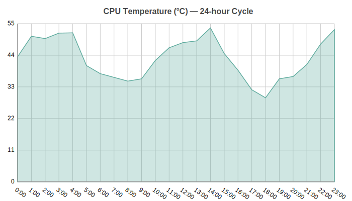
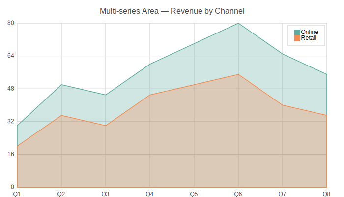

Area Charts
===========

Area chart with filled regions under the line. Shows magnitude of change over
time and is ideal for comparing multiple series stacked or overlaid.

Basic Usage
-----------

Single series area chart::

   from charted.charts import AreaChat

   chart = AreaChart(
       data=[120, -80, 150, -90, 170],
       labels=["Jan", "Feb", "Mar", "Apr", "May"],
       title="Monthly Trend"
   )
   chart.save("area.svg")

Multi-Series
------------

Overlapping area fills for comparing multiple data series::

   chart = AreaChart(
       data=[
           [10, 20, -30, 40],
           [-15, 25, -10, 35],
       ],
       labels=["Q1", "Q2", "Q3", "Q4"],
       series_names=["Revenue", "Expenses"],
       title="Revenue vs Expenses",
   )

Customizing Fill Opacity
------------------------

Adjust fill opacity for better visibility of overlaid areas::

   chart = AreaChart(
       data=[10, -5, 8, 15, -3],
       labels=["A", "B", "C", "D", "E"],
       fill_opacity=0.6,  # Default is 0.1; higher = more opaque
   )

Custom Colors
-------------

Override the default color palette::

   chart = AreaChart(
       data=[100, -20, 50],
       labels=["A", "B", "C"],
       theme={
           "colors": ["#2ECC71", "#3498DB"]
       }
   )

API Reference
-------------

.. autoclass:: charted.charts.area.AreaChat
   :members:
   :undoc-members:
   :show-inheritance:

   **Parameters:**

   - ``data`` — Single list (one series) or list of lists (multi-series)
   - ``labels`` — X-axis categories
   - ``x_data`` — Optional x-axis values for XY mode
   - ``series_names`` — Series names for legend
   - ``width`` — Width in pixels (default 800)
   - ``height`` — Height in pixels (default 600)
   - ``fill_opacity`` — Fill opacity 0-1 (default 0.1)
   - ``theme`` — Theme string or dict
   - ``title`` — Chart title

   **Example:**

   .. code-block:: python

      from charted import AreaChart

      chart = AreaChart(
          data=[10, -5, -8, 3, 5],
          labels=["A", "B", "C", "D", "E"],
          title="Trend",
      )
      chart.save("area.svg")
