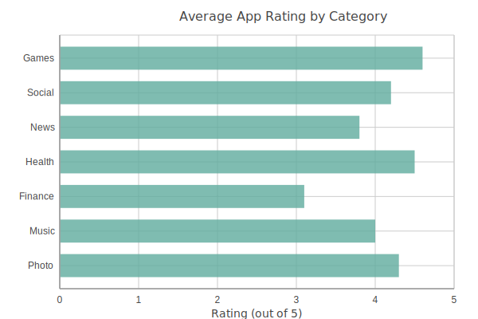
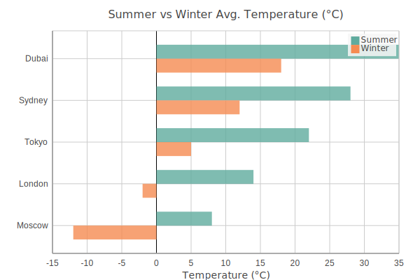

Bar Charts
==========

Horizontal bar chart. Supports negative values and multiple series.

Basic usage::

   from charted.charts.bar import BarChart

   chart = BarChart(data=[1, 2, 3], labels=["a", "b", "c"])
   chart.html

With negative values (profit/loss)::

   chart = BarChart(
       title="Profit/Loss by Region ($M)",
       data=[-12, 34, -8, 52, -5, 28, 41, -19],
       labels=["North", "South", "East", "West", "Central", "Pacific", "Atlantic", "Mountain"],
       width=700,
       height=500,
   )

Multi-series (side-by-side bars within each category)::

   chart = BarChart(
       title="Revenue vs Expenses by Quarter ($K)",
       data=[
           [120, -45, 180, -30, 210, -60],   # Revenue
           [-80, -20, -95, -15, -110, -25],  # Expenses
       ],
       labels=["Q1 Prod", "Q1 Ops", "Q2 Prod", "Q2 Ops", "Q3 Prod", "Q3 Ops"],
       width=700,
       height=500,
   )

Adjust spacing between bars with ``bar_gap`` (0–1, default 0.5)::

   chart = BarChart(data=[1, 2, 3], labels=["a", "b", "c"], bar_gap=0.3)

.. autoclass:: charted.charts.bar.BarChart
   :members:
   :undoc-members:
