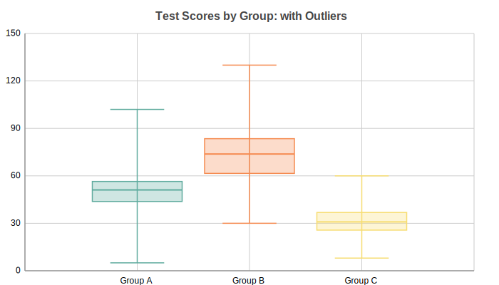

Box Plots
=========

Box plot showing distribution quartiles, median, and outliers for data series.
Displays minimum, Q1, median, Q3 (interquartile range), and maximum for each
group, making it easy to compare distributions side by side.

Basic Usage
-----------

Single group box plot::

   from charted.charts import BoxPlot

   chart = BoxPlot(
       data=[[1, 2, 5, 7, 10]],
       labels=["Group A"],
       title="Single Distribution",
   )
   chart.save("boxplot.svg")

Comparing Multiple Groups
-------------------------

Compare distributions across multiple groups::

   chart = BoxPlot(
       data=[
           [4, 5, 3, 6, 7, 8, 4, 6],
           [2, 4, 3, 5, 7, 8, 9, 3],
           [6, 7, 9, 8, 10, 6, 8, 5],
       ],
       labels=["Control", "Treatment A", "Treatment B"],
       title="Test Scores by Group",
   )

API Reference
-------------

.. autoclass:: charted.charts.box.BoxPlot
   :members:
   :undoc-members:
   :show-inheritance:

   **Parameters:**

   - ``data`` — List of lists; each inner list is raw data values for one group
   - ``labels`` — Labels for each group (box)
   - ``width`` — Chart width in pixel (default 800)
   - ``height`` — Chart height pixels (default 600)
   - ``theme`` — Theme string dict
   - ``title`` — Chart title

   **Example:**

   .. code-block:: python

      from charted import BoxPlot

      chart = BoxPlot(
          data=[
              [1, 2, 3, 5, 8, 8, 2],
              [4, 6, 7, 3, 9, 5, 8],
          ],
          labels=["Group A", "Group B"],
          title="Distribution Comparison",
      )
      chart.save("boxplot.svg")
