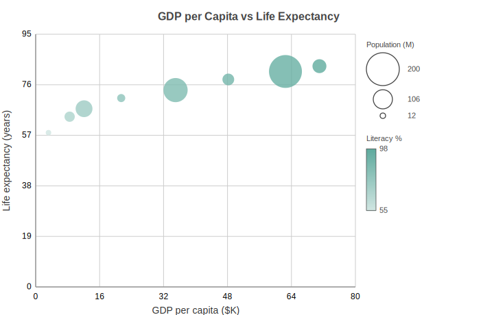

Bubble Charts
=============

Scatter plot where each marker's radius encodes a third data dimension. Useful when you want to show three variables at once: x, y, and a magnitude.

Basic Usage
-----------

A bubble chart takes ``x_data``, ``y_data``, and a matching list of ``sizes``::

   from charted.charts import BubbleChart

   chart = BubbleChart(
       x_data=[1, 2, 3, 4, 5],
       y_data=[10, 25, 15, 30, 20],
       sizes=[5, 30, 12, 45, 18],
       title="Sales by Region",
   )
   chart.save("bubble.svg")

The values in ``sizes`` are mapped linearly onto the ``[min_radius, max_radius]`` range, so the largest value becomes the largest bubble.

Radius Range
------------

Control the smallest and largest rendered marker radius::

   chart = BubbleChart(
       x_data=[1, 2, 3],
       y_data=[10, 20, 15],
       sizes=[5, 30, 12],
       min_radius=6.0,
       max_radius=40.0,
   )

Multi-Series
------------

Pass nested lists for ``x_data`` and ``y_data`` to draw more than one series::

   chart = BubbleChart(
       x_data=[[1, 2, 3], [1, 2, 3]],
       y_data=[[10, 20, 15], [5, 12, 9]],
       sizes=[5, 30, 12],
       series_names=["Group A", "Group B"],
   )

API Reference
-------------

.. autoclass:: charted.charts.bubble.BubbleChart
   :members:
   :undoc-members:
   :show-inheritance:

   **Parameters:**

   - ``x_data`` — X coordinates for each point
   - ``y_data`` — Y coordinates for each point
   - ``sizes`` — Third dimension; one non-negative value per point
   - ``min_radius`` — Smallest rendered marker radius in pixels (default 4.0)
   - ``max_radius`` — Largest rendered marker radius in pixels (default 24.0)
   - ``width`` — Chart width in pixels
   - ``height`` — Chart height in pixels
   - ``theme`` — Theme name string or theme dictionary
   - ``title`` — Chart title text
   - ``series_names`` — Names for each series (shown in legend)

   **Example:**

   .. code-block:: python

      from charted import BubbleChart

      chart = BubbleChart(
          x_data=[1, 2, 3, 4, 5],
          y_data=[10, 25, 15, 30, 20],
          sizes=[5, 30, 12, 45, 18],
          title="Sales by Region",
          theme="dark",  # or "light", "high-contrast"
      )
      chart.save("bubble.svg")
      print(chart.to_markdown())  # 
