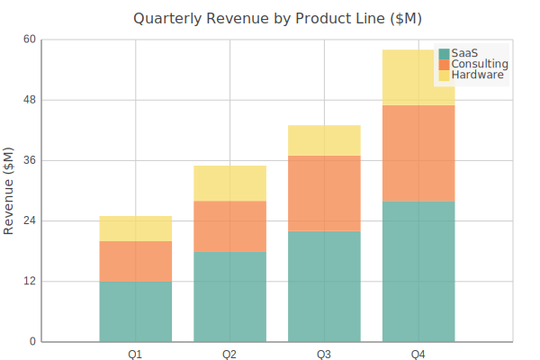

Column Charts
=============

Vertical column chart. Supports negative values and multiple series.

Basic usage::

   from charted.charts.column import ColumnChart

   chart = ColumnChart(data=[1, 2, 3], labels=["a", "b", "c"])
   chart.html

With negative values (growth rates)::

   chart = ColumnChart(
       title="Year-over-Year Growth Rate (%) by Segment",
       data=[12, -8, 22, 18, -5, 30],
       labels=["Q1", "Q2", "Q3", "Q4", "Q5", "Q6"],
       width=700,
       height=500,
   )

Multi-series (grouped columns, one per series)::

   chart = ColumnChart(
       title="Revenue vs Costs vs Net (%)",
       data=[
           [12, -8, 22, 18, -5, 30],    # Revenue
           [-3, -15, 5, -2, -20, 8],    # Costs
           [9, -23, 17, 16, -25, 38],   # Net
       ],
       labels=["Q1", "Q2", "Q3", "Q4", "Q5", "Q6"],
       width=700,
       height=500,
   )

Adjust column width with ``column_gap`` (0–1, default 0.5)::

   chart = ColumnChart(data=[1, 2, 3], labels=["a", "b", "c"], column_gap=0.3)

.. autoclass:: charted.charts.column.ColumnChart
   :members:
   :undoc-members:
