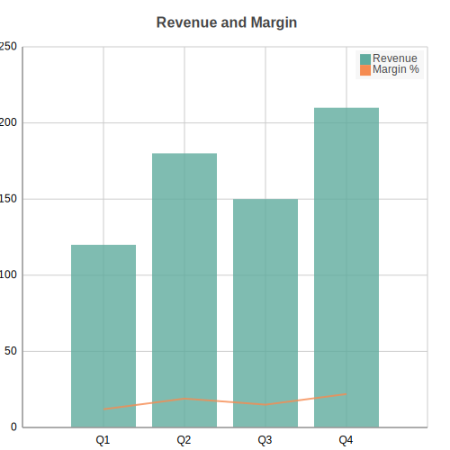

Combo Charts
============

Combo chart mixing bar/column and line/area series on shared axes. Useful when two related metrics live on different scales, such as revenue alongside a margin percentage.

Basic Usage
-----------

One bar series and one line series on a shared x-axis::

   from charted.charts import ComboChart

   chart = ComboChart(
       series=[
           {"data": [120, 180, 150, 210], "type": "bar", "name": "Revenue"},
           {"data": [12, 19, 15, 22], "type": "line", "name": "Margin %"},
       ],
       labels=["Q1", "Q2", "Q3", "Q4"],
       title="Revenue and Margin",
   )
   chart.save("combo.svg")

Each entry in ``series`` is a dict with ``data`` (the y-values), ``type`` (one of ``"bar"``, ``"column"``, ``"line"``, ``"area"``), an optional ``name`` for the legend, and an optional ``axis``. A ComboChart needs at least two series.

Secondary Axis
--------------

Assign a series to the secondary y-axis with ``"axis": "secondary"``. That series scales to its own range and its tick labels render on the right edge, so a small percentage can sit next to large counts without being flattened::

   chart = ComboChart(
       series=[
           {"data": [120, 180, 150], "type": "bar", "name": "Units"},
           {
               "data": [2.5, 3.1, 2.8],
               "type": "line",
               "name": "Conversion %",
               "axis": "secondary",
           },
       ],
       labels=["Jan", "Feb", "Mar"],
       title="Units vs Conversion",
   )
   chart.save("combo_secondary.svg")

API Reference
-------------

.. autoclass:: charted.charts.combo.ComboChart
   :members:
   :undoc-members:
   :show-inheritance:

   **Parameters:**

   - ``series``: List of series dicts, each with ``data``, ``type``, optional ``name`` and optional ``axis``
   - ``labels``: Category labels for the shared x-axis
   - ``width``: Chart width in pixels (default 800)
   - ``height``: Chart height in pixels (default 600)
   - ``title``: Chart title text
   - ``theme``: Theme name string or theme dictionary
   - ``x_label``, ``y_label``: Optional axis titles
   - ``column_gap``: Gap between side-by-side columns (default 0.2)

   **Example:**

   .. code-block:: python

      from charted import ComboChart

      chart = ComboChart(
          series=[
              {"data": [10, 20, 30], "type": "bar", "name": "Revenue"},
              {"data": [3, 6, 9], "type": "line", "name": "Margin"},
          ],
          labels=["Q1", "Q2", "Q3"],
          title="Revenue and Margin",
          theme="dark",  # or "light", "high-contrast"
      )
      chart.save("combo.svg")
