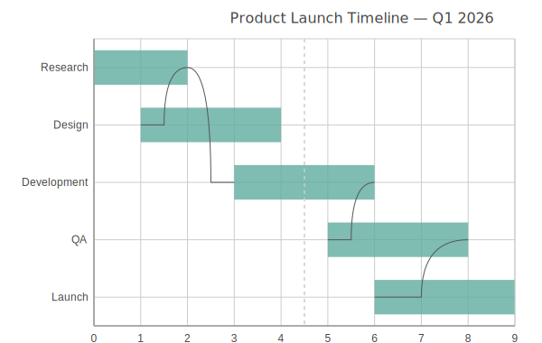

Gantt Charts
============

Gantt chart for project timeline visualization. Displays tasks as horizontal
bars along a timeline, with optional dependency arrows between related tasks.

Basic Usage
-----------

Simple task timeline::

   from charted.charts import GanttChart

   chart = GanttChart(
       data=[(1, 5), (3, 7), (6, 9)],
       labels=["Design", "Development", "Testing"],
       title="Project Timeline",
   )
   chart.save("gantt.svg")

Multi-Series Tasks
------------------

Grouped tasks with dependency arrows::

   chart = GanttChart(
       data=[
           [(0, 3), (4, 7)],
           [(2, 6), (6, 10)],
       ],
       labels=["Design", "Dev", "QA", "Deploy"],
       title="Multi-Phase Project",
   )

Dependency Arrows
-----------------

Draw arrows between dependent tasks::

   chart = GanttChart(
       data=[(1, 4), (3, 6), (5, 8)],
       labels=["Design", "Development", "Testing"],
       dependencies=[(0, 1), (1, 2)],
       title="Task Dependencies",
   )

Customizing Appearance
----------------------

Control bar height and show a today marker::

   chart = GanttChart(
       data=[(1, 3), (3, 5), (5, 7)],
       labels=["Task A", "Task B", "Task C"],
       bar_height_ratio=0.8,
       show_today_line=True,
       x_position=4,
   )

API Reference
-------------

.. autoclass:: charted.charts.gantt.GanttChart
   :members:
   :undoc-members:
   :show-inheritance:

   **Parameters:**

   - ``data``: List of (start, end) tuples for task bars
   - ``labels``: Task names on the y-axis
   - ``width``: Chart px px (default 800)
   - ``height``: Chart pixel px (default 600)
   - ``dependencies``: List of (from, to) task index tuples for arrows
   - ``bar_height_ratio``: Bar height as fraction of row (default 0.6)
   - ``show_today_line``: Draw dashed vertical line at x_position
   - ``x_position``: X value for the "today" line
   - ``theme``: Theme dictionary or string
   - ``title``: Chart title

   **Example:**

   .. code-block:: python

      from charted import GanttChart

      chart = GanttChart(
          data=[(1, 3), (4, 6), (7, 9)],
          labels=["Design", "Build", "Test"],
          title="Project Schedule",
      )
      chart.save("gantt.svg")
