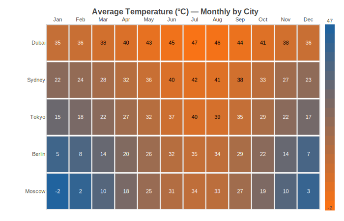

Heatmaps
========

Heatmap chart for visualizing matrix data with a color gradient. Each cell in
the grid is colored according to its value, with an optional legend scale on the
right side. Supports row and column labels and per-cell value annotations.

Basic Usage
-----------

Simple numeric matrix visualization::

   from charted.charts import HeatmapChart

   chart = HeatmapChart(
       data=[
           [1, 2, 3],
           [4, 5, 6],
           [7, 8, 9],
       ],
       x_labels=["A", "B", "C"],
       y_labels=["Row 1", "Row 2", "Row 3"],
       title="Matrix Values",
   )
   chart.save("heatmap.svg")

Correlation Matrix
------------------

Common use case for correlation matrices::

   chart = HeatmapChart(
       data=[
           [1.0, 0.85, -0.3],
           [0.85, 1.0, -0.2],
           [-0.3, -0.2, 1.0],
       ],
       x_labels=["X", "Y", "Z"],
       y_labels=["X", "Y", "Z"],
       title="Correlation Matrix",
       value_format=".2f",
   )

Customizing Colors and Display
------------------------------

Control the color scale range and display options::

   chart = HeatmapChart(
       data=[
           [10, 50, 90],
           [30, 60, 85],
           [20, 70, 95],
       ],
       x_labels=["A", "B", "C"],
       y_labels=["Row 1", "Row 2", "Row 3"],
       low_color="#1a6b8f",
       high_color="#f7a55c",
       show_values=True,
       value_format=".0f",
       cell_gap=0.05,
   )

API Reference
-------------

.. autoclass:: charted.charts.heatmap.HeatmapChart
   :members:
   :undoc-members:
   :show-inheritance:

   **Parameters:**

   - ``data`` — 2D matrix (list of list of numbers)
   - ``x_labels`` — Column labels (auto-generated if omitted)
   - ``y_labels`` — Row labels (auto-generated if omitted)
   - ``width`` — Chart px (default 800)
   - ``height`` — Chart px (default 600)
   - ``low_color`` — Color for minimum value (default "#1a6b8f")
   - ``high_color`` — Color for maximum value (default "#f7a55c")
   - ``show_values`` — Display values in cells (default True)
   - ``value_format`` — Format string for cell values (default ".1f")
   - ``cell_gap`` — Gap between cells as fraction (default 0.04)
   - ``label_font_size`` — Label font size px (default 11)
   - ``theme`` — Theme or theme dict
   - ``title`` — Chart title

   **Example:**

   .. code-block:: python

      from charted import HeatmapChart

      chart = HeatmapChart(
          data=[[1, 2], [3, 4]],
          x_labels=["A", "B"],
          y_labels=["X", "Y"],
          title="Sample Heatmap",
      )
      chart.save("heatmap.svg")
