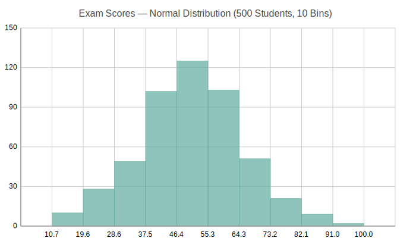

Histograms
==========

Histogram showing value distribution across evenly-spaced bins. Useful for
understanding the shape of data distributions, identifying skewness, and
finding outliers.

Basic Usage
-----------

Create a histogram from raw data::

   from charted.charts import Histogram

   chart = Histogram(
       data=[1.2, 1.5, 2.1, 2.3, 3.1, 3.5, 4.0, 4.2, 5.1, 5.5],
       bins=5,
       title="Data Distribution",
   )
   chart.save("histogram.svg")

Auto-Binning
------------

When ``bins`` is omitted, the library uses Sturges' rule to determine
a sensible number of bins based on the data size::

   chart = Histogram(
       data=[1.2, -0.5, 3.4, 2.1, -1.8, 0.9, 4.1, 3.0, 2.7, 1.8],
       title="Auto-Binned Distribution",
   )

Customizing Bins
----------------

Specify exact bin count for finer or coarser granularity::

   chart = Histogram(
       data=[1, 3, 2, 5, 4, 7, 6, 9, 8, 8],
       bins=10,  # More bins = more detail
       title="Fine-Grained Distribution",
   )

Custom Colors
-------------

Override the default color::

   chart = Histogram(
       data=[1, 2, -3, 4, -2, 3, -1, 5],
       bins=6,
       theme={
           "colors": ["#E74C3C"]
       },
       title="Red-Toned Histogram",
   )

API Reference
-------------

.. autoclass:: charted.charts.histogram.Histogram
   :members:
   :undoc-members:
   :show-inheritance:

   **Parameters:**

   - ``data``: Single flat list of numeric values to bin
   - ``bins``: Number of bins (auto-computed if None)
   - ``labels``: Optional x-axis labels (auto-generated if omitted)
   - ``width``: Chart width px (default 800)
   - ``height``: Chart height px (default 600)
   - ``theme``: Theme dict or string
   - ``title``: Chart title

   **Example:**

   .. code-block:: python

      from charted import Histogram

      chart = Histogram(
          data=[1, 2, 1, 3, 5, 4, 3, 2],
          bins=5,
          title="Value Distribution",
      )
      chart.save("histogram.svg")
