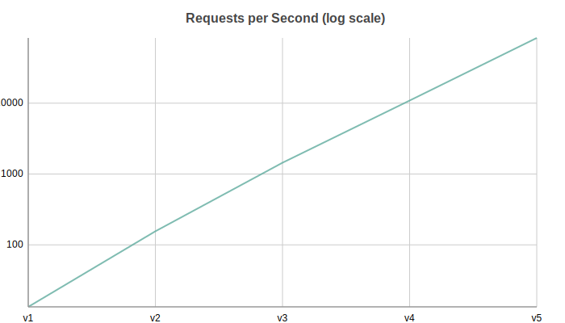
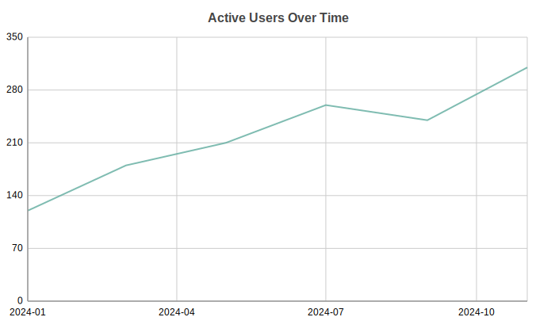

Line Charts
===========

Line chart with support for multi-series, negative values, and custom x-axis positions (XY mode). Perfect for trends over time or continuous data.

.. image:: ../examples/line.svg
   :width: 100%

Basic Usage
-----------

Single series line::

   from charted.charts import LineChart

   chart = LineChart(
       data=[120, 180, 210, 150, 230],
       labels=["Jan", "Feb", "Mar", "Apr", "May"],
       title="Monthly Sales Trend"
   )
   chart.save("line.svg")

Multi-Series
------------

Multiple overlapping lines for comparison::

   import math

   n = 20
   chart = LineChart(
       title="Signal Analysis: Raw vs Filtered vs Baseline",
       data=[
           [math.sin(i * 0.5) * 30 + (i % 7 - 3) * 5 for i in range(n)],  # Raw
           [math.sin(i * 0.5) * 25 for i in range(n)],                      # Filtered
           [math.sin(i * 0.5) * 10 - 5 for i in range(n)],                  # Baseline
       ],
       labels=[str(i) for i in range(n)],
       series_names=["Raw", "Filtered", "Baseline"],
       width=700,
       height=400,
   )

.. image:: ../examples/line.svg
   :width: 100%

XY Mode
-------

Use custom x-axis values instead of sequential indices::

   years = list(range(1990, 2010))
   anomalies = [-15, -5, 10, 20, 5, 25, 15, 30, 10, 20, 40, 25, 45, 30, 50, 35, 60, 55, 45, 70]

   chart = LineChart(
       title="Temperature Anomaly vs Baseline (1990-2009)",
       data=[anomalies, [0] * len(years)],
       x_data=years,  # Custom x-axis values
       labels=[str(y) for y in years],
       series_names=["Anomaly", "Baseline"],
       width=700,
       height=400,
   )

.. image:: ../examples/xy_line.svg
   :width: 100%

With Negative Values
--------------------

Lines automatically handle negative values, crossing the zero baseline::

   chart = LineChart(
       title="Monthly Profit/Loss ($K)",
       data=[
           [120, -45, 180, -30, 210, -60],   # 2023
           [150, -20, 200, -15, 180, -40],   # 2024
       ],
       labels=["Jan", "Feb", "Mar", "Apr", "May", "Jun"],
       series_names=["2023", "2024"],
       width=700,
       height=400,
   )

Log Scale
---------

Use ``y_scale="log"`` when the data spans several orders of magnitude. Tick labels fall on powers of ten and all values must be positive::

   chart = LineChart(
       title="Requests per Second (log scale)",
       data=[12, 140, 1300, 9800, 75000],
       labels=["v1", "v2", "v3", "v4", "v5"],
       y_scale="log",
   )
   chart.save("line_log_y.svg")

The same option works on the x-axis via ``x_scale="log"``.

Time Axis
---------

Pass date or datetime values as ``x_data`` together with ``x_scale="time"`` to get a date-aware axis with formatted tick labels. ISO date strings are accepted too::

   from datetime import date

   chart = LineChart(
       title="Active Users Over Time",
       data=[120, 180, 210, 260, 240, 310],
       x_data=[
           date(2024, 1, 1),
           date(2024, 3, 1),
           date(2024, 5, 1),
           date(2024, 7, 1),
           date(2024, 9, 1),
           date(2024, 11, 1),
       ],
       x_scale="time",
   )
   chart.save("line_time_x.svg")

Configuration Options
---------------------

Line styling::

Line styling::

   # Custom line width and markers via series_style
   chart = LineChart(
       data=[120, 180, 210],
       labels=["Q1", "Q2", "Q3"],
       series_style={
           "stroke_width": 3.0,
           "marker_shape": "square",
           "marker_size": 6.0
       }
   )

Custom colors::

   chart = LineChart(
       data=[[120, 180], [80, 95]],
       labels=["Q1", "Q2"],
       series_names=["Revenue", "Expenses"],
       theme={
           "colors": {
               "palette": ["#2ECC71", "#E74C3C"]
           }
       }
   )

API Reference
-------------

.. autoclass:: charted.charts.line.LineChart
   :members:
   :undoc-members:
   :show-inheritance:

   **Parameters:**

   - ``data`` — Single list for one series, or list of lists for multi-series
   - ``labels`` — X-axis labels (or use ``x_data`` for XY mode)
   - ``x_data`` — Custom x-axis values for XY mode (optional)
   - ``series_names`` — Names for each data series (shown in legend)
   - ``width`` — Chart width in pixels (default 800)
   - ``height`` — Chart height in pixels (default 600)
   - ``theme`` — Theme name string or theme dictionary
   - ``title`` — Chart title text
   - ``subtitle`` — Optional subtitle text

   **Example:**

   .. code-block:: python

      from charted import LineChart

      chart = LineChart(
          data=[[120, 180, 210], [80, 95, 110]],
          labels=["Q1", "Q2", "Q3"],
          series_names=["Revenue", "Expenses"],
          title="Trend Analysis",
          theme="dark"  # or "light", "high-contrast"
      )
      chart.save("line.svg")
      print(chart.to_markdown())  # 
