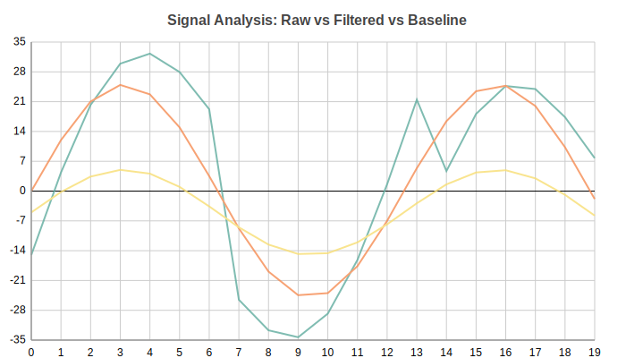
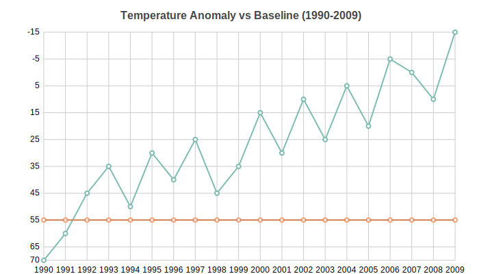

Line Charts
===========

Continuous line chart — great for time-series, trends, and signal data. Supports multiple overlapping series, negative values, and custom x-axis positions.

Basic usage::

   from charted.charts.line import LineChart

   chart = LineChart(data=[1, 2, 3], labels=["a", "b", "c"])
   chart.html  # returns SVG string

Multi-series (overlapping lines)::

   import math
   n = 20
   chart = LineChart(
       title="Signal Analysis: Raw vs Filtered vs Baseline",
       data=[
           [math.sin(i * 0.5) * 30 + (i % 7 - 3) * 5 for i in range(n)],  # Raw
           [math.sin(i * 0.5) * 25 for i in range(n)],                      # Filtered
           [math.sin(i * 0.5) * 10 - 5 for i in range(n)],                  # Baseline
       ],
       labels=[str(i) for i in range(n)],
       width=700,
       height=400,
   )

XY mode with real x-values (temperature anomaly)::

   chart = LineChart(
       title="Temperature Anomaly vs Baseline (1990-2009)",
       data=[anomalies, [0] * 20],
       x_data=list(range(1990, 2010)),
       labels=[str(y) for y in range(1990, 2010)],
       width=700,
       height=400,
   )

.. autoclass:: charted.charts.line.LineChart
   :members:
   :undoc-members:
