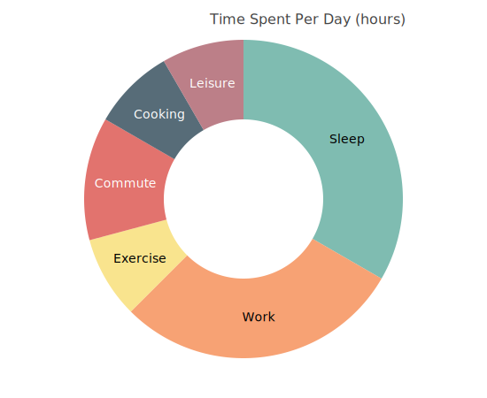

Pie Charts
==========

Pie chart for showing parts of a whole.

.. image:: ../examples/pie.svg
   :width: 100%

Basic usage::

   from charted.charts.pie import PieChart

   chart = PieChart(values=[25, 35, 20, 20], labels=["A", "B", "C", "D"])
   chart.html

With title and labels::

   chart = PieChart(
       title="Sales Distribution",
       values=[45, 30, 15, 10],
       labels=["Electronics", "Clothing", "Food", "Other"],
       width=500,
       height=400,
   )

Doughnut mode (inner_radius creates a hole in the center)::

   chart = PieChart(
       title="Market Share",
       values=[40, 30, 20, 10],
       labels=["Company A", "Company B", "Company C", "Others"],
       inner_radius=0.3,  # 0.0 = pie, 0.3 = doughnut
       width=500,
       height=400,
   )

With custom colors::

   chart = PieChart(
       values=[25, 35, 20, 20],
       labels=["A", "B", "C", "D"],
       colors=["#FF6B6B", "#4ECDC4", "#45B7D1", "#FFA07A"],
   )

Parameters:

- ``values``: List of numeric values (must be >= 0, at least one > 0)
- ``labels``: Optional list of category labels
- ``colors``: Optional list of colors for slices
- ``inner_radius``: 0.0–1.0, 0 = pie, >0 = doughnut

.. autoclass:: charted.charts.pie.PieChart
   :members:
   :undoc-members:
