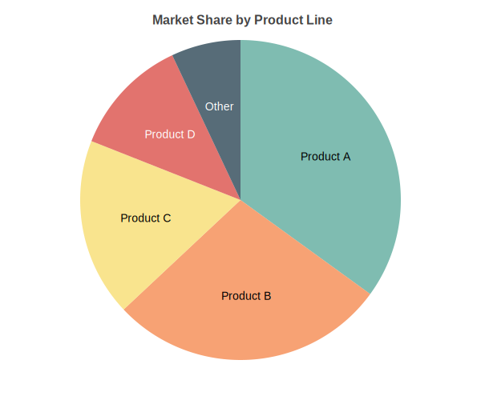

Pie Charts
==========

Basic usage::

   from charted.charts.pie import PieChart

   chart = PieChart(data=[45, 30, 15, 10], labels=["A", "B", "C", "D"])
   chart.html

With explode::

   chart = PieChart(
       data=[45, 30, 15, 10],
       labels=["A", "B", "C", "D"],
       explode=10,
   )

.. autoclass:: charted.charts.pie.PieChart
   :members:
   :undoc-members:
