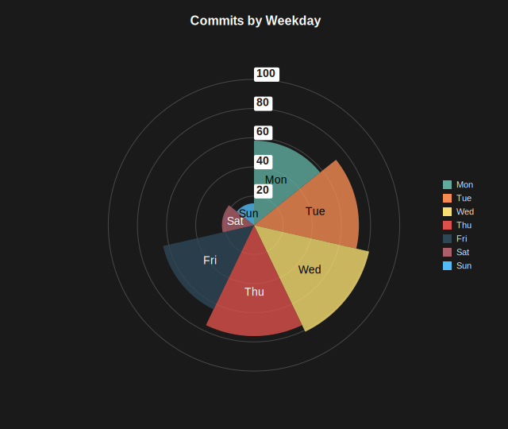

Polar Area Charts
=================

A pie chart variant where every slice spans an equal angle and the slice radius encodes the value. Larger values reach further out from the center, which makes magnitude differences easier to compare than slice angle alone.

Basic Usage
-----------

Pass a list of non-negative values, one per slice::

   from charted.charts import PolarAreaChart

   chart = PolarAreaChart(
       data=[10, 20, 30, 15, 25],
       labels=["A", "B", "C", "D", "E"],
       title="Activity by Category",
   )
   chart.save("polar_area.svg")

All slices share the same angular width of ``360 / N`` degrees. Each slice's radius is scaled by its value, with the smallest value still drawn as a visible sliver.

Rotation
--------

Control the starting angle of the first slice::

   chart = PolarAreaChart(
       data=[10, 20, 30, 15],
       labels=["N", "E", "S", "W"],
       start_angle=45,
   )

Custom Colors
-------------

Override the default palette with a theme::

   chart = PolarAreaChart(
       data=[10, 20, 30],
       labels=["A", "B", "C"],
       theme={
           "colors": ["#2ECC71", "#3498DB", "#E74C3C"]
       }
   )

API Reference
-------------

.. autoclass:: charted.charts.polar_area.PolarAreaChart
   :members:
   :undoc-members:
   :show-inheritance:

   **Parameters:**

   - ``data``: Non-negative values, one per slice
   - ``labels``: Labels for each slice
   - ``width``: Chart width in pixels
   - ``height``: Chart height in pixels
   - ``theme``: Theme name string or theme dictionary
   - ``title``: Chart title text
   - ``start_angle``: Starting angle in degrees (0 = top, clockwise)
   - ``series_styles``: Optional per-slice styling overrides
   - ``show_percentages``: Show each slice's percentage of the total

   **Example:**

   .. code-block:: python

      from charted import PolarAreaChart

      chart = PolarAreaChart(
          data=[10, 20, 30, 15, 25],
          labels=["A", "B", "C", "D", "E"],
          title="Activity by Category",
          theme="dark",  # or "light", "high-contrast"
      )
      chart.save("polar_area.svg")
      print(chart.to_markdown())  # 
