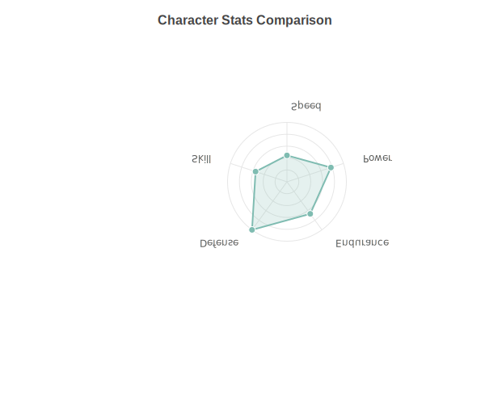
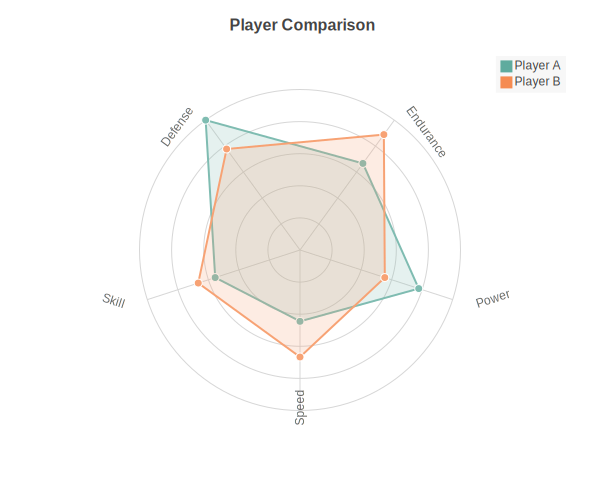

Radar Charts
============

Radar (or spider) charts display multivariate data on a two-dimensional chart with axes radiating from a central point. Each axis represents a variable, with concentric grid lines showing scale. Supports multi-series comparison.

Basic Usage
-----------

Single series radar chart::

   from charted.charts import RadarChart

   chart = RadarChart(
       data=[85, 90, 75, 88, 92],
       labels=["Speed", "Strength", "Defense", "Technique", "Stamina"],
       title="Player Stats"
   )
   chart.save("radar.svg")

Multi-Series Comparison
-----------------------

Compare multiple series on the same radar chart::

   chart = RadarChart(
       title="Player Skill Comparison",
       data=[
           [85, 90, 75, 88, 92],  # Player A
           [70, 85, 90, 75, 80],  # Player B
       ],
       labels=["Speed", "Strength", "Defense", "Technique", "Stamina"],
       series_names=["Player A", "Player B"],
       width=600,
       height=500,
   )

Custom Grid Levels
------------------

Control the number of concentric grid rings::

   chart = RadarChart(
       data=[20, 35, 30, 45, 25],
       labels=["Speed", "Power", "Endurance", "Defense", "Skill"],
       grid_levels=8,  # More grid rings
   )

Customizing Radius
------------------

Adjust the chart radius relative to the canvas size::

   chart = RadarChart(
       data=[20, 35, 30, 45, 25],
       labels=["Speed", "Power", "Endurance", "Defense", "Skill"],
       radius=0.35,  # Smaller chart area (default 0.45)
   )

Hiding Axis Labels
------------------

Remove axis labels for a cleaner look::

   chart = RadarChart(
       data=[20, 35, 30, 45, 25],
       labels=["Speed", "Power", "Endurance", "Defense", "Skill"],
       show_axis_labels=False,
   )

Custom Colors
-------------

Override the default color palette::

   chart = RadarChart(
       data=[85, 90, 75, 88, 92],
       labels=["Speed", "Strength", "Defense", "Technique", "Stamina"],
       theme={
           "colors": ["#FF6B6B", "#4ECDC4"]
       }
   )

Or use a built-in theme::

   chart = RadarChart(
       data=[85, 90, 75, 88, 92],
       labels=["Speed", "Strength", "Defense", "Technique", "Stamina"],
       theme="dark"
   )

Configuration Options
---------------------

Complete radar chart configuration::

   chart = RadarChart(
       data=[
           [85, 90, 75, 88, 92],
           [70, 85, 90, 75, 80],
       ],
       labels=["Speed", "Strength", "Defense", "Technique", "Stamina"],
       series_names=["Player A", "Player B"],
       title="Player Skill Comparison",
       width=600,
       height=500,
       radius=0.45,           # Chart radius as ratio (default 0.45)
       grid_levels=5,         # Number of concentric grid circles
       show_axis_labels=True, # Display axis labels
       label_offset=20,       # Distance from grid edge for labels
   )

API Reference
-------------

.. autoclass:: charted.charts.radar.RadarChart
   :members:
   :undoc-members:
   :show-inheritance:

   **Parameters:**

   - ``data``: Single list of values or list of lists for multi-series
   - ``labels``: Labels for each axis (one per data point in series)
   - ``series_names``: Names for each data series (shown in legend)
   - ``radius``: Chart radius as ratio of min(width, height) (default 0.45)
   - ``grid_levels``: Number of concentric grid circles (default 5)
   - ``show_axis_labels``: Whether to display axis labels (default True)
   - ``label_offset``: Distance from grid edge for labels (default 20)
   - ``width``: Chart width in pixels (default 500)
   - ``height``: Chart height in pixels (default 500)
   - ``theme``: Theme name string or theme dictionary
   - ``title``: Chart title text
   - ``subtitle``: Optional subtitle text

   **Example:**

   .. code-block:: python

      from charted import RadarChart

      chart = RadarChart(
          data=[85, 90, 75, 88, 92],
          labels=["Speed", "Strength", "Defense", "Technique", "Stamina"],
          title="Player Stats"
      )
      chart.save("radar.svg")
      print(chart.to_markdown())  # 
