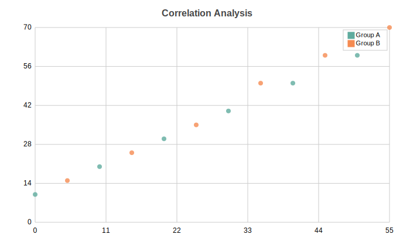

Scatter Charts
==============

Basic usage::

   from charted.charts.scatter import ScatterChart

   chart = ScatterChart(x_data=[1, 2, 3], y_data=[1, 4, 9])
   chart.html

Multi-series::

   chart = ScatterChart(
       x_data=[[1, 2, 3], [2, 3, 4]],
       y_data=[[1, 4, 9], [4, 9, 16]],
   )

.. autoclass:: charted.charts.scatter.ScatterChart
   :members:
   :undoc-members:
