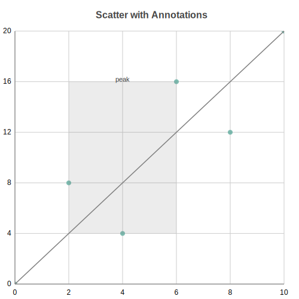

Scatter Charts
==============

Scatter plot with support for multi-series and custom marker shapes. Perfect for showing relationships between two variables.

.. image:: ../examples/scatter.svg
   :width: 100%

Basic Usage
-----------

Single series scatter::

   from charted.charts import ScatterChart

   chart = ScatterChart(
       data=[[1, 2], [2, 3], [3, 5], [4, 4], [5, 7]],
       labels=["Data Points"],
       title="Correlation Example"
   )
   chart.save("scatter.svg")

Multi-Series
------------

Multiple scatter series for comparison::

   chart = ScatterChart(
       data=[
           [[1, 2], [2, 3], [3, 5], [4, 4]],      # Series A
           [[1, 1], [2, 2], [3, 4], [4, 6]],      # Series B
       ],
       labels=["Series A", "Series B"],
       title="Comparing Distributions",
       width=700,
       height=500,
   )

.. image:: ../examples/scatter.svg
   :width: 100%

Custom X/Y Data
---------------

Alternative format with explicit x_data and y_data::

   chart = ScatterChart(
       x_data=[1, 2, 3, 4, 5],
       y_data=[2, 4, 5, 4, 6],
       labels=["Product Sales"],
       title="Price vs Sales"
   )

Marker Customization
--------------------

Change marker shape and size::

   # Circle markers (default)
   chart = ScatterChart(
       x_data=[1, 2, 3],
       y_data=[[2, 3, 5]],
       series_styles=[{"marker_shape": "circle", "marker_size": 6.0}]
   )

   # Square markers
   chart = ScatterChart(
       x_data=[1, 2, 3],
       y_data=[[2, 3, 5]],
       series_styles=[{"marker_shape": "square", "marker_size": 8.0}]
   )

   # Diamond markers
   chart = ScatterChart(
       x_data=[1, 2, 3],
       y_data=[[2, 3, 5]],
       series_styles=[{"marker_shape": "diamond", "marker_size": 7.0}]
   )

Custom Marker Styling::

   chart = ScatterChart(
       x_data=[1, 2, 3],
       y_data=[[2, 3, 5]],
       series_styles=[{
           "marker_shape": "circle",
           "marker_size": 8.0,
           "fill": "#FF6B6B",
           "stroke": "#333333",
           "stroke_width": 2.0
       }]
   )

With Trend Lines
----------------

Combine scatter with line chart for trend visualization::

   import math

   # Scatter data
   x = list(range(20))
   y = [math.sin(i * 0.5) * 30 + (i % 7 - 3) * 5 for i in range(20)]

   chart = ScatterChart(
       x_data=x,
       y_data=[y],
       labels=["Noisy Data"],
       title="Signal with Trend",
       series_styles=[{"marker_shape": "circle", "marker_size": 4.0}]
   )

Configuration Options
---------------------

Custom colors per series::

   chart = ScatterChart(
       x_data=[[1, 2], [1, 2]],
       y_data=[[2, 3], [1, 2]],
       labels=["Series A", "Series B"],
       series_styles=[
           {"marker_shape": "circle", "marker_size": 6.0, "color": "#2ECC71"},
           {"marker_shape": "square", "marker_size": 6.0, "color": "#3498DB"}
       ]
   )

Annotations
-----------

Annotations let you draw extra marks on top of the plot, positioned in data
coordinates and reprojected through the chart axes at render time. They work on
any Cartesian chart (scatter, line, bar, column, area), not just scatter plots.

Three primitives are available from ``charted.charts.annotations``:

- ``BoxAnnotation`` shades a rectangular region given an ``x_range`` and
  ``y_range``.
- ``LineAnnotation`` draws a straight segment between a ``start`` and ``end``
  point.
- ``LabelAnnotation`` places a text label at a single ``point``.

Pass them through the ``annotations`` argument::

   from charted.charts import ScatterChart
   from charted.charts.annotations import (
       BoxAnnotation,
       LineAnnotation,
       LabelAnnotation,
   )

   chart = ScatterChart(
       x_data=[0, 2, 4, 6, 8, 10],
       y_data=[0, 8, 4, 16, 12, 20],
       title="Scatter with Annotations",
       annotations=[
           BoxAnnotation(x_range=(2, 6), y_range=(4, 16)),
           LineAnnotation(start=(0, 0), end=(10, 20)),
           LabelAnnotation(point=(4, 16), text="peak"),
       ],
   )
   chart.save("scatter_annotations.svg")

Each primitive accepts optional styling. ``BoxAnnotation`` takes ``color`` and
``opacity``; ``LineAnnotation`` takes ``color``, ``width``, and ``dashed``;
``LabelAnnotation`` takes ``color``, ``font_size``, and ``text_anchor``. When a
color is omitted it falls back to the active theme.

API Reference
-------------

.. autoclass:: charted.charts.scatter.ScatterChart
   :members:
   :undoc-members:
   :show-inheritance:

   **Parameters:**

   - ``data`` — List of [x, y] pairs, or list of lists for multi-series
   - ``x_data`` — Alternative: explicit x values (optional)
   - ``y_data`` — Alternative: explicit y values (optional)
   - ``labels`` — Series names (shown in legend)
   - ``width`` — Chart width in pixels (default 800)
   - ``height`` — Chart height in pixels (default 600)
   - ``theme`` — Theme name string or theme dictionary
   - ``title`` — Chart title text
   - ``subtitle`` — Optional subtitle text

   **Example:**

   .. code-block:: python

      from charted import ScatterChart

      chart = ScatterChart(
          data=[[1, 2], [2, 4], [3, 5], [4, 4], [5, 7]],
          labels=["Product Sales"],
          title="Price vs Demand",
          theme="dark"  # or "light", "high-contrast"
      )
      chart.save("scatter.svg")
      print(chart.to_markdown())  # 
